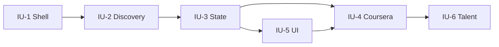

# DropClass MVP Plan

## Problem

Agents have **skills** (narrow tools) but not **talents** (domain judgment from structured study). DropClass sends an agent through a real Coursera MOOC (discovered via Class Central) with human supervision, aiming at **platform quiz completion** and eventual certificate.

## Scope

### In scope (MVP)

- **Atelier shell** — React UI + FastAPI gateway (`atelier/`)
- **DropClass engine** — Python package (`dropclass/`)
- Class Central search → Coursera candidate list
- One enrollment lifecycle: create → progress units → quiz attempts
- Supervisor UI: discover, enroll, view progress, approve blockers
- Playwright Coursera loop for **one pilot course week** (auto-graded quizzes)
- Talent profile export (prompt + notes JSON on disk)
- Parallel **local formation** fallback when browser breaks (transcript ingest)

### Out of scope (MVP)

- Multi-provider (edX, Udacity)
- Autonomous payment / Honorlock proctoring
- Peer-graded assignment automation
- Model fine-tuning
- HOOT integration (deferred)

## Architecture

```
atelier/app/     React — /formation (discover, enrollments, approvals)
atelier/api/     FastAPI — mounts dropclass.api.routes
dropclass/       Engine — discovery, store, coursera agent, talent export
```

**Dev ports:** API `8100`, UI `5180`

## Requirements traceability

| Req (brainstorm) | Plan unit |
|------------------|-----------|
| Coursera cert north star | IU-4, IU-6 (quiz pass first; cert Phase 2) |
| Class Central discovery | IU-2 |
| React/Python, not standalone | IU-1 (Atelier shell) |
| DropClass-first shell | IU-1, IU-5 |
| Talent > skill | IU-6 export artifact |
| Human supervises agent | IU-5 approvals UI |

## Implementation units

### IU-1: Atelier shell scaffold ✅ (initial)

**Repos:** `atelier/api/main.py`, `atelier/app/src/**`, `atelier/scripts/*.ps1`

**Done:** Health endpoint, Formation routes placeholder, Vite proxy, start scripts.

**Remaining:** Wire `/api/formation/*` from UI; error boundaries; env docs.

**Tests:** Manual — `GET /health`, UI loads home + formation.

---

### IU-2: Class Central discovery

**Files:** `dropclass/discovery/classcentral.py`, `dropclass/discovery/parser.py` (new), `dropclass/tests/test_classcentral.py`

**Behavior:**

- `GET /api/formation/discover?subject=cartography`
- Parse Class Central search HTML → normalize: title, provider, url, free/audit hints
- Filter/rank Coursera-first; cap at 20 results

**Test scenarios:**

- Parser extracts ≥1 course from saved HTML fixture
- Empty subject → `[]`
- Non-Coursera results deprioritized not dropped
- HTTP timeout → 502 with message

**Risks:** HTML structure changes — keep fixture tests + graceful degradation.

---

### IU-3: Formation state (SQLite)

**Files:** `dropclass/formation/store.py`, `dropclass/formation/models.py` (new), `dropclass/formation/db.py` (new)

**Behavior:**

- `POST /api/formation/enrollments` — course_title, coursera_url
- `GET /api/formation/enrollments` — list with progress, status
- `PATCH /api/formation/enrollments/{id}` — status transitions
- Persist under `~/.atelier/formations/` or `./data/formations.db`

**Test scenarios:**

- Create enrollment returns id
- List returns created enrollment
- Invalid status transition rejected
- DB survives process restart

---

### IU-4: Coursera student loop (Playwright)

**Files:** `dropclass/coursera/session.py`, `dropclass/coursera/quiz.py`, `dropclass/coursera/runner.py`, `dropclass/tests/test_coursera_runner.py` (mocked)

**Behavior:**

- Human logs in once; session storage persisted (encrypted local file)
- Agent per enrollment: open week N → consume content (video skip if transcript) → submit auto-graded quiz
- Report scores back to store; emit events for UI poll/WebSocket (optional v1.1)

**Pilot course criteria:**

- Free audit
- ≥1 week auto-graded quizzes
- Minimal peer review

**Test scenarios:**

- Runner state machine: `pending → active → unit_complete → blocked → done`
- Quiz handler parses score from mocked DOM fixture
- Session missing → `blocked` + `needs_login` flag
- ToS note documented in `docs/coursera-automation.md`

**Risks:** UI churn, CAPTCHA, login expiry — human-in-loop by design.

---

### IU-5: Formation UI (supervisor)

**Files:** `atelier/app/src/pages/formation/Discover.tsx`, `Enrollments.tsx`, `EnrollmentDetail.tsx` (new), `atelier/app/src/lib/formation-api.ts` (new)

**Behavior:**

- Discover: search → table of candidates → Enroll button
- Enrollments: list progress bars, status badges, blocked reasons
- Detail: unit checklist, quiz scores, Approve buttons (login, payment, peer)

**Test scenarios:**

- Discover calls API and renders rows
- Enroll POST refreshes list
- Blocked enrollment shows approval CTA

---

### IU-6: Talent export

**Files:** `dropclass/formation/talent.py`, `dropclass/tests/test_talent.py`

**Behavior:**

- On ≥80% syllabus + passing quizzes: write `talents/{enrollment_id}.json`
- Contents: domain vocabulary, heuristics, exemplar Q&A from formation logs, competency score

**Test scenarios:**

- Export only when thresholds met
- JSON schema stable/versioned
- Re-export idempotent

---

## Sequencing



**Recommended execution order:** IU-1 (finish wire-up) → IU-2 → IU-3 → IU-5 (discover/enroll) → IU-4 → IU-6

## Pilot course selection (gate)

Before IU-4, manually verify one Coursera course:

1. Find via Class Central (subject + free filter)
2. Confirm audit access without paywall on week 1
3. Confirm week 1 quizzes are auto-graded
4. Record URL in `dropclass/docs/pilot-course.md`

## Success criteria (MVP)

1. Supervisor discovers ≥5 Coursera candidates for a subject via UI
2. One enrollment completes week 1 units with ≥1 quiz submitted via agent
3. Progress visible in Atelier UI without reading logs
4. Talent JSON exported OR documented blocker for cert path
5. `pytest dropclass/tests` green

## Open execution unknowns (defer to ce-work)

- Exact Class Central HTML selectors
- Coursera DOM for quiz submission (pilot-course specific)
- Whether Playwright runs headless or headed on Windows for login
- WebSocket vs poll for progress updates

## Next command

`/ce-work` or `/implement` starting at **IU-2** (IU-1 scaffold landed).